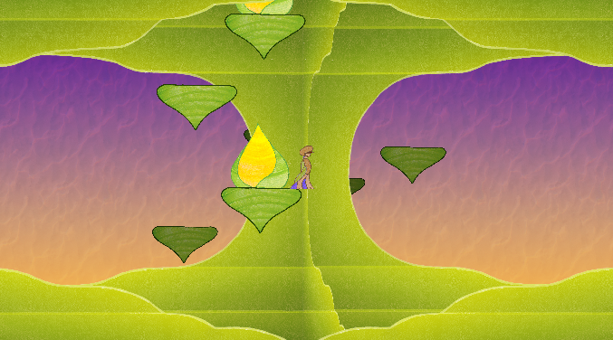
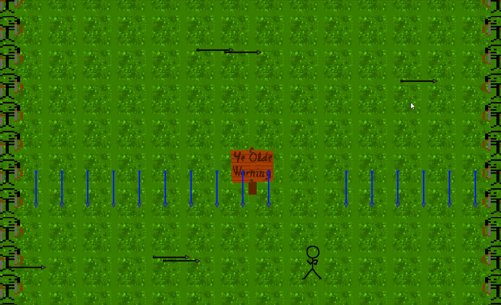

## Walker Kugel
WalkerK3@protonmail.com

I am a student at George Washington Carver Center for Arts and Technology. I will be a freshman at UMBC next year. I love the process of retro programming and making video games.

## My Projects

### C Programs
- Disaster Island (unfinished)
  - A 2D platformer game. This game randomly generates its world. Uses the OpenGL, SDL2, and Freetype libraries.

### TI-84 Assembler Programs
- Assembler (unfinished)
  - This program allows you to edit ez80 code on the calculator itself.
- Mio
  - Troll program, writes an image to the screen. Uses its own compression algorithm to store the image within 64KB.
- Cup Catch
  - A game where you catch a falling ball by moving around a cup.
- 9 + 10
  - Troll program, will install itself and give incorrect math answers.

### 6502 Programs
- Dungeon (unfinished)
  - A 2D top-down game where you evade a ghost. Made for the Nintendo Entertainment System, which used a 6502 variant.

### Unity Programs

- Rebirth (unfinished)
  - Platformer RPG where you become what you kill. I did the programming, my friend did assets.

[Play LASERS here!](https://kraken80.github.io/arrows_mobile/index.html)
- LASERS
  - A top-down game where you avoid lasers all over the screen.
